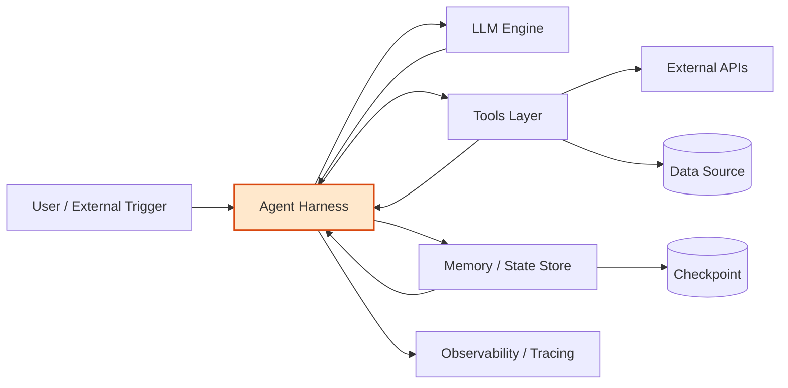
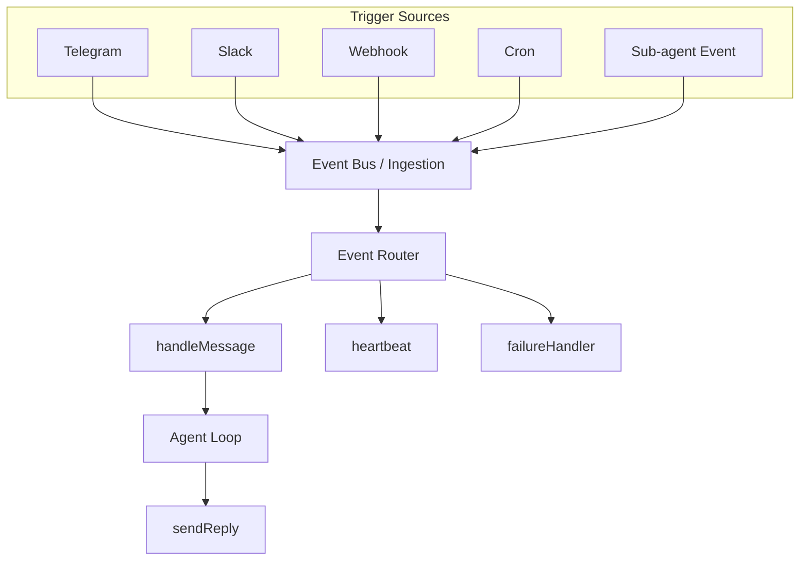
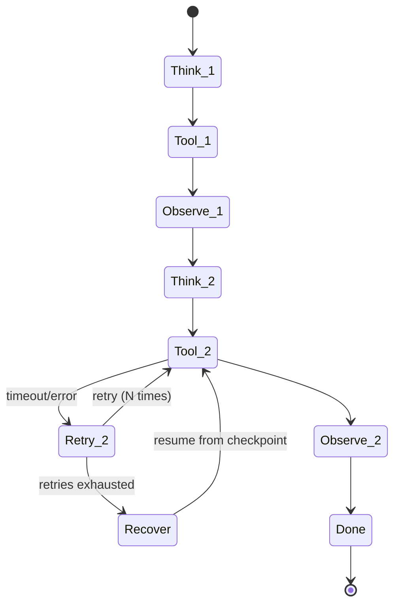
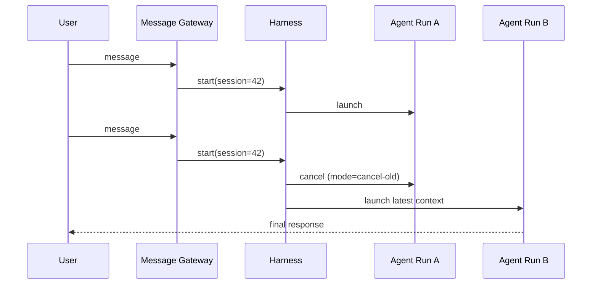

# 27.1 Why AI Agents Need a Harness：Lessons from Utah

这里的 **harness** 不是字面上的“马具/安全带”，而是一个工程隐喻：

> 在 Agent 系统里，LLM、tools、memory 都是组件，但它们之间需要一个“协调层”来保证系统可靠运行，这个协调层就是 harness。

它本身不做核心业务，但负责系统的 **连接、管理、保护与可观测**。

---

## 1. Harness 的三个工程类比

### 1.1 Wiring Harness（线束）

汽车线束连接发动机、传感器、ECU、仪表盘等模块。它不产生动力，但负责：

1. 连接组件
2. 整理线路
3. 防止干扰与损坏
4. 保证信号正确传输

没有线束，系统会接线混乱、故障难排查、信号不稳定。

### 1.2 Test Harness（测试支架）

软件中的 test harness 通常包含：

- test runner
- mock service
- log capture
- setup / teardown
- assertion framework

它负责搭建环境、运行与记录测试，但不实现业务逻辑本身。

### 1.3 Safety Harness（安全带）

安全带不负责“完成任务”，而是在人或系统失误时提供保护与兜底。

---

## 2. Agent 系统中的 Harness 定义

在 Agent 系统里可以粗略理解为：

```text
LLM      -> engine
tools    -> peripherals
memory   -> storage
harness  -> infrastructure layer
```

Harness 负责：

```text
连接组件
管理流程
处理失败
保证状态
控制并发
记录执行
```


### 2.1 架构总览图（Agent Harness 作为协调层）



这个图强调：LLM、Tools、Memory 都是可替换组件，Harness 才是把它们编排成“可运行系统”的中枢。

### 2.2 事件驱动触发图（Universally Triggered）



这个图对应“触发解耦”：新增入口通常只改 `Trigger -> Event` 转换层，不改主循环。

### 2.3 Durable 执行与恢复图（Step Retry / Resume）



这个图表示“失败只重试失败 step”，而不是整条链路从头执行。

### 2.4 会话并发控制图（Single Active Run）



这个图体现“同一会话同一时刻只有一个有效 run”，避免上下文污染与响应错位。

---

## 3. Utah 给出的 6 个关键机制

### 3.1 Trigger 解耦（Universally Triggered）

一个 Agent 可能由 Slack、Telegram、Webhook、Cron、子 Agent 等来源触发。Utah 的做法是统一进入事件层：

```text
source trigger -> event -> agent handler
```

这样新增触发源只需新增转换，不需要改核心 loop。

### 3.2 Durable Execution（可持久执行）

将推理与工具调用拆分为可重试 step：

```text
think -> tool-call -> observe -> think
```

某一步失败时只重试该步；崩溃后也可以从最近可恢复点继续。

### 3.3 Event-driven Orchestration（事件驱动编排）

不要用一个巨型函数把收消息、推理、回复、失败处理全包。更推荐拆成多个函数并用事件衔接，获得：

- 更好的失败隔离
- 更清晰的扩展边界
- 更独立的观测与重试

### 3.4 Concurrency Control（并发控制）

同一会话短时间收到多条消息时，容易出现上下文污染与响应错位。Utah 的典型策略是会话级串行，或“新请求取消旧运行”，保证单会话同一时刻只有一个有效 run。

### 3.5 Context Management（上下文治理）

多轮工具调用后，上下文会快速膨胀。常见治理策略：

- **pruning**：压缩历史工具输出，只保留关键片段
- **compaction**：达到阈值后做会话摘要
- **iteration budget**：限制循环次数，防止工具调用失控

### 3.6 Step-level Observability（步骤级可观测性）

需要可审计的步骤轨迹，例如：

```text
step 1: LLM call
step 2: tool search
step 3: LLM reasoning
step 4: tool call
```

这样才能在生产中定位性能瓶颈、分析失败路径、持续优化策略。

---

## 4. 一句话结论

Utah 的核心启示是：

> Agent 的难点不只是模型能力，而是分布式系统层面的可靠性。

当模型能力持续趋同时，真正拉开差距的是 Harness 的工程质量。
