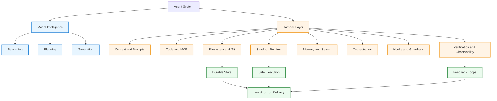

# 27.2 The Anatomy of an Agent Harness

> TL;DR：**Agent = Model + Harness**。Harness Engineering 的目标，是把“模型智能”转化为“可持续产出工作的系统能力”。模型提供智能，Harness 让智能变得可用、可控、可扩展。

## 什么是 Harness？

一句话定义：

- **Agent = Model + Harness**
- 如果你写的部分不是模型权重本身，那大概率就是 Harness。

Harness 是所有“非模型本体”的代码、配置和执行逻辑。裸模型不是 Agent；只有当它被赋予状态、工具执行、反馈回路和可执行约束后，它才真正成为 Agent。

典型 Harness 组件包括：

- System Prompts（系统提示）
- Tools / Skills / MCP 及其描述
- Bundled Infrastructure（文件系统、沙箱、浏览器）
- Orchestration Logic（子 Agent、handoff、模型路由）
- Hooks / Middleware（压缩、续跑、lint、确定性校验）

这一定义的价值在于：它迫使我们围绕模型智能设计系统，而不是把“Agent 能力”误当成模型天生自带。

## 配图重绘（Mermaid 版）

> 说明：原帖配图强调 “Agent = Model + Harness” 及 Harness 的关键构件。下面用 Mermaid 重画为可维护的结构图，并针对 VitePress 渲染稳定性做了简化（ASCII 节点 ID、单行标签、避免复杂嵌套语法）。

你也可以把这张图理解成一条工程化链路：

- Model 负责“会想”；
- Harness 负责“能做、可控、可验证”；
- 两者结合，才形成可持续交付的 Agent 系统。

## 为什么模型需要 Harness（从模型能力边界出发）

开箱即用的模型通常是“输入多模态信息，输出文本”。但实际工作里，我们希望 Agent 还能：

- 持久化跨会话状态
- 执行代码
- 获取实时知识
- 搭建环境与安装依赖

这些都不是模型天然能力，而是 Harness 层能力。

例如最常见的“聊天产品形态”本身就是 Harness：通过循环追加历史消息，让模型看起来“记得对话”。核心思想是：**把期望行为映射为可运行的 Harness 特性**。

## 从目标行为反推 Harness 设计

我们用统一推导模式：

> 想要（或修复）的行为 → 对应的 Harness 设计

### 1) 文件系统：持久存储与上下文管理

目标：让 Agent 能处理真实数据、卸载上下文负载、跨会话延续工作。

设计：Harness 提供文件系统抽象和 fs 工具。

价值：

- Agent 拥有可读写工作区（代码、文档、数据）
- 中间产物可落盘，不必全部塞进上下文
- 多 Agent / 人类可通过共享文件协作
- Git 进一步提供版本化、回滚、分支实验能力

> 文件系统是最基础的 Harness 原语之一，后续许多能力都建立在它之上。

### 2) Bash + 代码执行：通用问题求解器

目标：不为每个动作都提前手写工具，允许 Agent 自主求解。

设计：Harness 提供 bash/代码执行工具，支持 ReAct 循环中的“思考→行动→观察→再思考”。

价值：

- 给模型一台“可编程计算机”
- 模型可动态写脚本构造临时工具
- 通用性远高于固定工具集合

### 3) 沙箱与验证工具：安全执行与闭环纠错

目标：让 Agent 在安全、可复现的环境中执行与验证工作。

设计：Harness 对接隔离沙箱，配置默认运行时、CLI、测试器、浏览器、日志等。

价值：

- 避免在本地直接执行高风险代码
- 支持按任务弹性创建/销毁环境，支撑规模化并行
- 通过测试、日志、截图形成自验证回路（写代码→跑测试→读错误→修复）

### 4) 记忆与搜索：持续学习与知识更新

目标：让 Agent 记住经验，并访问训练后新增信息。

设计：

- 用文件系统承载可注入记忆（如 `AGENTS.md`）
- 引入 Web Search / MCP（如 Context7）获取最新上下文

价值：

- 形成“会话外持续学习”
- 突破知识截止时间（knowledge cutoff）

### 5) 对抗 Context Rot：上下文腐化治理

目标：长任务中性能不随上下文膨胀而显著下降。

设计：

- **Compaction**：上下文逼近上限时做摘要压缩
- **Tool Output Offloading**：工具超长输出仅保留头尾，完整结果落盘
- **Skills 渐进披露**：避免启动时塞入过多工具/MCP 描述

价值：

- 控制上下文噪声
- 延缓推理退化
- 保障长流程稳定性

### 6) 长时自主执行：跨上下文窗口持续交付

目标：让 Agent 在长时间跨度内自主、正确地完成复杂任务。

设计：

- 文件系统 + Git：持久追踪进度与历史
- Ralph Loop：拦截“提前结束”，在新上下文里续跑原目标
- 计划与自验证：计划分解 + 失败回注 + 测试驱动迭代

价值：

- 缓解早停、分解失败与跨窗口失连
- 形成可持续推进的执行机制

## Harness 的未来：与模型协同进化

今天的主流 Agent 产品往往是“模型 + Harness”共同后训练产物。结果是：

- 某些 Harness 原语（如文件系统、bash、规划）会逐渐被模型“内化”
- 但模型也可能对特定 Harness 逻辑产生路径依赖（迁移时性能波动）

这意味着：

- 不要默认“官方 Harness”一定最适合你的任务
- 针对目标场景优化 Harness，依然有巨大性能杠杆

随着模型变强，Harness 不会消失，而会从“补缺陷”走向“系统放大器”：

- 编排上百 Agent 并行协作
- 让 Agent 反思执行轨迹并修复 Harness 级故障
- 为任务动态拼装工具与上下文（JIT Harness）

## 总结

这篇方法论的核心是：

1. **先定义行为目标，再反推 Harness 原语**；
2. **Agent 能力上限 = 模型能力 × Harness 工程质量**；
3. 在模型快速同质化的时代，Harness Engineering 将持续是构建高质量 Agent 系统的关键差异化能力。
