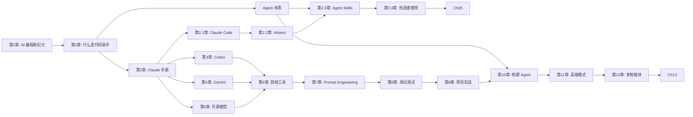

# 内容架构总览

本文档展示 AI 编程手册的整体内容架构和各章节之间的关系。

## 整体架构图

```mermaid
graph TB
    Root[AI 编程手册] --> P1[第一部分：入门]
    Root --> P2[第二部分：核心工具详解]
    Root --> P3[第三部分：高级技巧与实战]
    Root --> P4[第四部分：实践 - 从零构建 Agent]
    Root --> P5[第五部分：自主代码库]

    P1 --> C1[第1章: AI 编程新纪元]
    P1 --> C2[第2章: 什么是代码助手]
    P1 --> Agent[Agent 本质]

    C1 --> Vibe[Vibecoding 辩论]
    C1 --> Camp[三大心态阵营]

    C2 --> ToolUse[工具使用原理]
    C2 --> ClaudeAdv[Claude 优势]

    P2 --> Ch2[第2章: Claude 手册]
    P2 --> Ch21[2.1: Claude Code 架构]
    P2 --> Ch22[2.2: Advent of Claude]
    P2 --> Ch23[2.3: Agent Skills]
    P2 --> Ch24[2.4: 创造者使用]
    P2 --> Ch25[2.5: Showcase 配置]
    P2 --> Ch26[2.6: 上下文管理]
    P2 --> Ch27[2.7: 高级功能]
    P2 --> Ch3[第3章: OpenAI Codex]
    P2 --> Ch4[第4章: Gemini 实战]
    P2 --> Ch5[第5章: 开源模型]
    P2 --> Ch6[第6章: 其他工具概览]

    P3 --> Ch7[第7章: Prompt Engineering]
    P3 --> Ch8[第8章: AI驱动测试调试]
    P3 --> Ch9[第9章: 综合项目实战]

    P4 --> Ch10[第10章: 从零构建 Agent]
    P4 --> Ch11[第11章: 高级 Agent 模式]
    P4 --> Ch12[第12章: 多智能体系统]
    P4 --> Ch13[第13章: 从怀疑者到信徒]

    P5 --> Ch14[第14章: 自主代码库]

    style P1 fill:#e1f5fe
    style P2 fill:#fff3e0
    style P3 fill:#f3e5f5
    style P4 fill:#e8f5e9
    style P5 fill:#fce4ec
```



## 章节依赖关系



## 学习路径推荐

### 路径一：新手入门（4-6周）
```
第一部分：入门（1周）
    ↓
第二部分：选择1-2个工具深入学习（2-3周）
    ↓
第三部分：基础技巧（1-2周）
```

### 路径二：进阶提升（6-8周）
```
第一部分：快速浏览（3天）
    ↓
第二部分：全部工具掌握（3-4周）
    ↓
第三部分：高级技巧（2周）
    ↓
第四部分：构建自己的Agent（1-2周）
```

### 路径三：专家精通（持续）
```
按需选择：
- 第五部分：自主代码库（前沿方向）
- 深入研究特定工具的源码
- 贡献开源项目
- 开发自己的AI编程工具
```
