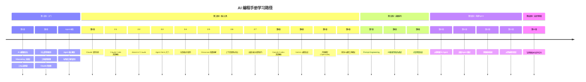

# 学习路径时间线

本时间线图展示了从入门到精通的完整学习路径。

```mermaid
timeline
    title AI 编程手册学习路径

    section 第一部分：入门
        第1章 : AI 编程新纪元
              : Vibecoding 大辩论
              : 三大心态阵营
        第2章 : 什么是代码助手
              : 工具使用原理
              : Claude 的优势
        Agent本质 : Agent 核心概念
                  : 与传统工具的区别

    section 第二部分：核心工具
        第2章 : Claude 使用手册
        2.1 : Claude Code 深度解析
        2.2 : Advent of Claude
        2.3 : Agent Skills 入门
        2.4 : 创造者如何使用
        2.5 : Showcase 配置拆解
        2.6 : 上下文管理与添加
        2.7 : 高级功能与使用技巧
        第3章 : OpenAI Codex 深度解析
        第4章 : Gemini 编程实战
        第5章 : 开源模型 (Opencode)
        第6章 : 其他AI编程工具概览

    section 第三部分：高级技巧
        第7章 : Prompt Engineering
        第8章 : AI驱动的测试与调试
        第9章 : 综合项目实战

    section 第四部分：构建Agent
        第10章 : 从零构建 AI Agent
        第11章 : 高级 Agent 模式
        第12章 : 多智能体系统
        第13章 : 从怀疑者到信徒

    section 第五部分：自主代码库
        第14章 : 背景智能体与软件交付
```

## 学习建议

1. **新手路径**：第一部分 → 第二部分（选择1-2个工具深入学习）→ 第三部分
2. **进阶路径**：第二部分全部 → 第三部分 → 第四部分
3. **专家路径**：根据兴趣选择第四部分和第五部分深入研究
